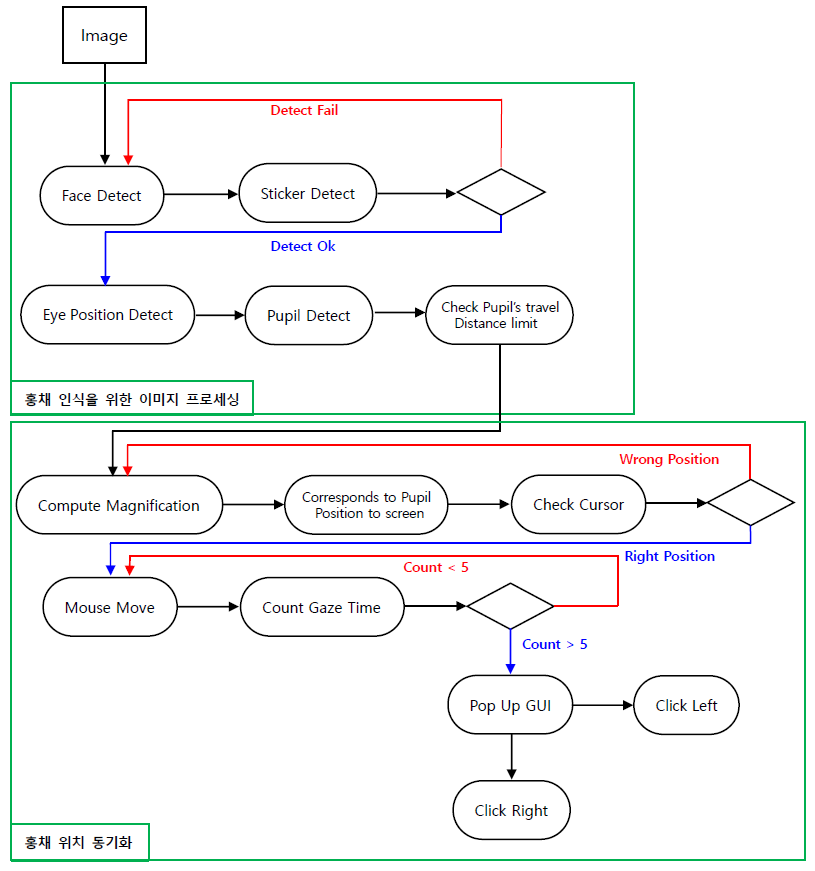
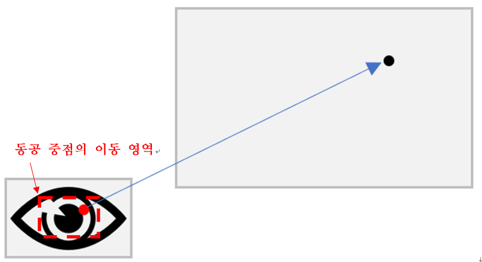

# EyeMouse
## 1. Project Overview 
+ ### Purpose 
  * Web-cam을 기반으로 한 Eye-mouse 개발
  * Deep-Learning을 통한 사용자 인식 정확도 개선
  * 이미지 분석을 통한 시선 처리
  * 눈만으로도 조작 가능한 UI
  * 기존 안구마우스보다 쉬운 접근성

+ ### Project Goal
  - 사용자의 얼굴을 인식하고 사용자의 안구 움직임에 따라 마우스를 움직이거나 사용자의 명령을 받아 몸이 불편한 사람도 컴퓨터를 사용할 수 있는 Eye Mouse를 개발한다.

## 2. Project Description
+ ### Project Requirement
  * 카메라를 이용하여 사용자의 얼굴을 인식한다.
  *	눈의 초점에 따라 마우스 커서를 움직이게 한다.
  *	마우스 커서의 기능은 한 곳을 일정 시간 응시하면 오픈 된다.
+ ### Configuration
  * 카메라로 사용자의 얼굴을 프레임으로 인식한다.
  *	인식된 프레임들을 이용하여 얼굴을 왜곡시켜 머신러닝을 통하여 프로그램이 러닝한다.
  *	output으로 나온 xml파일을 이용하여 python project (pycharm)을 이용하여 프로그램을 실행한다.
  *	두 눈의 초점의 중점을 잡아서 해당 컴퓨터의 마우스 커서를 움직이게 한다.
  *	마우스 기능 및 그 외의 기능들을 실행하기 위해서는 한 곳을 일정 시간 응시하고, interface가 출현한다.
+ ### Eyemouse System Process
  * 
+ ### Pupil Synchronizing
  * 

## 3. Project Development Process
+ ### Face Detection
  * OpenCV Face Detection Cascade
  * Sticker Detection
    * Harr-Cascade Learning
      - opencv_haartraining
      - opencv_traincascade
+ ### Eye Detection
  * OpenCV Eye Detection Cascade
  * Dlib Eye Detection
+ ### Pupil Detection
  * ThresHolding & Contour

## 4. How To Use
* `Z` Botton : Input Xmin
* `X` botton : Input Xmax
* `C` Botton : Input Ymin
* `V` botton : Input Ymax
* `B` Botton : Scale Recalculation
* `N` Botton : Click On
* `M` botton : Click Off
* `Q` botton : Quit
* `F` botton : Cursor Recalculation
* `R` botton : reset

## 5. DOCS 
- [2018 추계학술대회 논문](docs/2018추계학술대회논문-아이마우스.pdf)
- [EyeMouse PPT](docs/EyeMousePPT.pdf)
- [Final Report](docs/FinalReport.docx)
